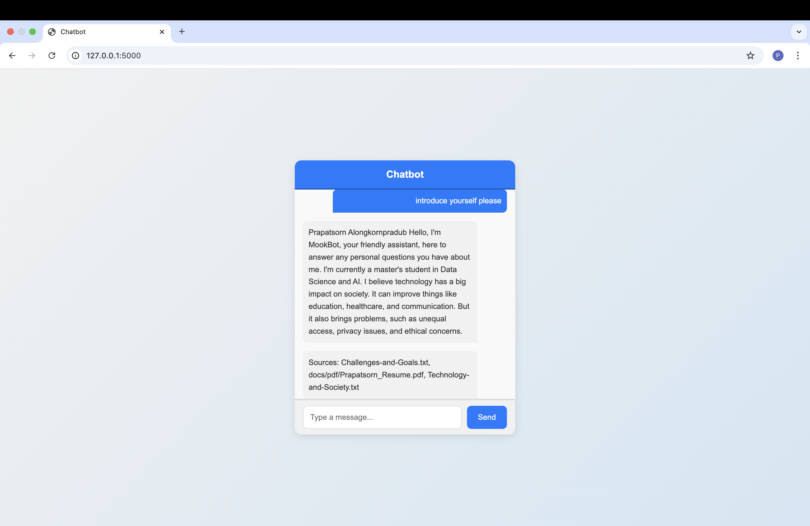

# Personalized Chatbot Using RAG and LangChain

This project implements a **Retrieval-Augmented Generation (RAG)**-based chatbot using the **LangChain framework**. The chatbot is designed to answer questions related to my personal information, such as my education, work experience, research interests, and beliefs. The chatbot uses a combination of **retrieval model** (FAISS) and **generator model** (HuggingFace) to provide accurate and context-aware responses.

## Data Collection and Preparation

**1. Relevant Sources:**
- **Resume:** A PDF document containing my education, work experience, and skills.
- **Challenges and Goals:** A text file outlining my academic challenges and objectives.
- **Core Beliefs:** A text file outlining my beliefs about technology and society.

**2. Prompt Design:**
- The chatbot uses a **prompt template** to guide its responses. The template includes placeholders for context and question, ensuring the chatbot provides gentle and informative answers.
- Prompt Template:
```
I'm MookBot, your friendly assistant, here to answer any personal questions you have about my background and experiences. 
Whether you're curious about my age, education, career, or personal beliefs, feel free to ask, and I'll provide answers to help you learn more about me. 
Just let me know what you're wondering about, and I'll do my best to share.
{context}
Question: {question}
Answer:
```

**3. Exploration of Other Models:**
The use of **Groq**, specifically the **llama-3.1-8b-instant** model, was explored as an alternative to HuggingFace and OpenAI models. While Groq was not implemented in the final code, an analysis of its potential benefits and limitations was conducted.

**Groq**  is a hardware and software company that provides **low-latency inference** for large language models (LLMs). Their `llama-3.1-8b-instant` model is optimized for speed and efficiency, making it ideal for real-time applications.

**Similarities Between Groq and HuggingFace Model**
- **Text Generation:**
    - Both Groq and the hugging face models are designed for text generation.
    - They can be integrated into LangChain for RAG-based chatbots.
- **Customizable:**
    - Parameters like `temperature`, `max_tokens`, and `repetition_penalty` can be adjusted to control the output.

**Differences Between Groq and HuggingFace Model**
- **Model Architecture:**
    - **Groq:** Uses the `llama-3.1-8b-instant` model, which is **optimized for low-latency inference**. This makes it highly efficient for real-time applications.
    - **HuggingFace:** Uses the `fastchat-t5-3b-v1.0` model, which is a **general-purpose text-generation model**. It prioritizes accuracy and flexibility over speed.
- **Performance:**
    - **Groq:** Known for its **speed and efficiency**, Groq is ideal for applications requiring real-time responses, such as live chat interfaces.
    - **HuggingFace:** While slightly slower, HuggingFace models excel in **accuracy and creativity**, making them better suited for tasks requiring detailed or nuanced responses.
- **Cost and Accessibility:**
    - **Groq:** Has **limited request capacity**, which might require careful usage planning to avoid hitting rate limits.
    - **HuggingFace:** Offers more **flexible usage options**, including free access to many models via the HuggingFace Hub, with paid options for higher usage or specialized models.
- **Use Case:**
    - **Groq:** Best for **real-time**, **low-latency applications** where speed is critical.
    - **HuggingFace:** Better for **tasks requiring high accuracy**, **creativity**, or **flexibility** , such as generating detailed responses or handling complex queries.

## Model Evaluation and Improvements

**1. Retriever and Generator Models:**
- **Retriever Model: FAISS:**
    - FAISS (Facebook AI Similarity Search) is used for **efficient storage and retrieval of document embeddings**.
    - It enables fast similarity search, allowing the chatbot to quickly fetch relevant documents based on user queries.
    - FAISS is particularly effective for handling large datasets, making it ideal for retrieving information from extensive personal documents like resumes and research papers.

- **Generator Model: HuggingFace** `fastchat-t5-3b-v1.0`:
    - The generator model is based on HuggingFace’s `fastchat-t5-3b-v1.0`, a **text-generation model fine-tuned for conversational tasks**.
    - It generates coherent and context-aware responses by leveraging the retrieved documents and the provided prompt template.
    - The model’s flexibility allows it to handle a wide range of questions, from factual queries about education and work experience to more abstract topics like beliefs and research interests.

- **Integration:** 
    - The retriever and generator models work together in a **Retrieval-Augmented Generation (RAG)** framework, combining the strengths of efficient document retrieval and high-quality text generation.
    - This integration ensures that the chatbot provides accurate, relevant, and informative answers to user queries.

**2. Analysis of Issues:**
- **Retriever Issues**
    - **Unrelated Documents:**
        - Occasionally, the retriever fetches unrelated documents if the **chunk size is too large** or the **embeddings are not well-aligned** with the query.
        - **Resolution:**
            - Reduced the chunk size to ensure more precise retrieval.
            - Experimented with different embedding models to improve alignment with the queries.
    - **Incomplete Context:**
        - If the retrieved documents don’t contain enough context, the generator might produce incomplete or irrelevant answers.
        - **Resolution:**
            - Added overlapping chunks (`chunk_overlap`) to ensure continuity between chunks.
            - Improved document preprocessing to include more relevant information.

- **Generator Issues**
    - **Generic or Unrelated Answers:**
        - The generator sometimes produces generic or unrelated answers if the **prompt template is too vague** or lacks sufficient context.
        - **Resolution:**
            - Refined the prompt template to include more specific instructions and context.
            - Adjusted the `temperature` parameter to balance creativity and accuracy.
    - **Blank Answers:**
        - For some questions, the generator produced blank answers, especially if the retriever failed to fetch relevant documents or the prompt template didn’t provide enough guidance.
        - **Resolution:**
            - Added a fallback mechanism to handle blank answers gracefully (e.g., "I don’t have enough information to answer that question. Please ask something else.").
            - Ensured the documents contain comprehensive information to answer all predefined questions.

- **Additional Observations**
    - **Memory Limitations:**
        - If the memory window size is too small, the chatbot might lose context for unrelated questions.
        - **Resolution:**
            - Increased the memory window size to retain more context from previous interactions.

    - **Query Refinement:**
        - Some questions required refinement to align with the retrieved documents and prompt template.
        - **Resolution:**
            - Used a **question generator** to refine user queries based on chat history, ensuring better alignment with the context.

## Web Application
**1. Chat Interface:**
- The web application features a simple chat interface where users can type questions and receive responses.
- The interface is built using **Flask** and includes an input box for user queries.

**2. Response Generation:**
- The chatbot generates coherent responses based on user input and provides relevant source documents to support its answers.
- **Example:** If the user asks, "What is your highest level of education?", the chatbot responds with, "I am currently pursuing a Master's degree in Data Science and AI," along with source documents.

### Web Application Sample Screenshot


**3. 10 Sample Responses from the Chatbot:**

```json
[
  {
    "question": "How old are you?",
    "answer": "As of 2023, I am 24 years old."
  },
  {
    "question": "What is your highest level of education?",
    "answer": "Master of Science in Data Science and Artificial Intelligence"
  },
  {
    "question": "What major or field of study did you pursue during your education?",
    "answer": "Actuarial Science."
  },
  {
    "question": "How many years of work experience do you have?",
    "answer": "As of 2023, I have 2 years of work experience as a Data Analyst and 1 year as a Data Analyst Intern."
  },
  {
    "question": "What type of work or industry have you been involved in?",
    "answer": "I have been involved in various industries such as finance, insurance, and technology. I have worked as a Data Analyst and Reporting Analyst in various companies in Thailand. I have also worked as a Data Analyst Intern at WorkVenture Technologies Company Limited in Bangkok."
  },
  {
    "question": "Can you describe your current role or job responsibilities?",
    "answer": "Sure, here are some more details about my previous roles and responsibilities as a data analyst: \n1. Reporting Analyst: As a reporting analyst at Thairath Group, I was responsible for recording and updating the database for all team's usage. I also managed multiple reports to ensure all data was accurate and organized. I generated Excel calculation files to reduce input time and improve productivity. I supported managers and performed other administrative duties as assigned. \n2. Data Analyst: As a Data Analyst at Toyota Nakornping Chiangmai Company Limited, I was responsible for analyzing and creating reports on a daily, weekly, monthly, and yearly basis. I worked on ad-hoc analysis and visualizations."
  },
  {
    "question": "What are your core beliefs regarding the role of technology in shaping society?",
    "answer": ""
  },
  {
    "question": "How do you think cultural values should influence technological advancements?",
    "answer": "As technology becomes part of everyday life, it should reflect the beliefs and needs of different cultures. This means that technology should be fair, respect privacy, and help create a more equal society. By considering cultural values, we can make sure that new technologies benefit everyone and are used in a way that is good for the world. \nBy considering cultural values, we can make sure that new technologies benefit everyone and are used in a way that is good for the world. This means that technology should be fair, respect privacy, and help create a more equal society. By considering cultural values, we can make sure that new technologies benefit everyone and"
  },
  {
    "question": "As a master’s student, what is the most challenging aspect of your studies so far?",
    "answer": ""
  },
  {
    "question": "What specific research interests or academic goals do you hope to achieve during your time as a master’s student?",
    "answer": ""
  }
]
```

**Note on *Blank* Answers**

While using **Retrieval-Augmented Generation (RAG)** with **Langchain**, some answers were initially left *blank*. However, after changing the sequence of the questions, it was observed that the previously blank answers were filled in. This indicates that the order in which questions are asked can influence the model's ability to generate relevant responses. The model may depend on the context provided by earlier questions, and reordering them can help ensure the necessary information is available for complete answers.

## Installation

**1. Clone the Repository:** Clone the repository to your local machine.
```bash
git clone https://github.com/Prapatsorn-A/rag-chatbot-personal-info.git
cd rag-chatbot-personal-info
```

**2. Install Dependencies:** Install the dependencies listed in `requirements.txt`.
```bash
pip install -r requirements.txt
```

**3. Run the Flask App:**
```bash
python app.py
```

**4. Access the Web Application:**
- Open your browser and go to `http://127.0.0.1:5000`.

## Acknowledgements

- **Professor Chaklam Silpasuwanchai** and **Teaching Assistant Todsavad Tangtortan** for guidance and support
- **LangChain Framework:** For providing the tools to build the **Retrieval-Augmented Generation (RAG)** pipeline and integrate retrieval and generation models seamlessly.

- **Hugging Face Transformers Library:** For providing the `fastchat-t5-3b-v1.0` model and other resources used in text generation and embedding.

- **FAISS (Facebook AI Similarity Search):** For enabling efficient storage and retrieval of document embeddings.

- **Groq:** For offering the `llama-3.1-8b-instant` model, which was explored as an alternative for real-time text generation.

**Link to the notebooks:** 
- [01-rag-langchain.ipynb](https://github.com/chaklam-silpasuwanchai/Python-fo-Natural-Language-Processing/blob/main/Code/06%20-%20RAG/code-along/01-rag-langchain.ipynb)